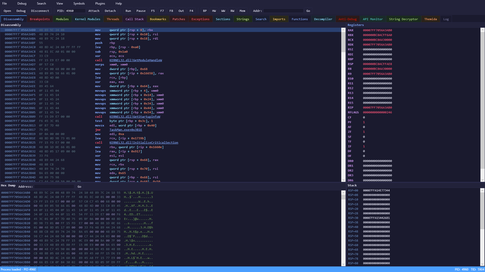

# KernelFlirt

Windows kernel-level debugger with an OllyDbg-style interface. Designed for security research and reverse engineering in VM environments (VMware).



## Architecture

```
  Host machine                           VM (Windows 10, testsigning)
┌──────────────────┐    TCP:31337    ┌──────────────────┐     IOCTL      ┌──────────────────┐
│  KernelFlirt UI  │◄───────────────►│   KfRelay.exe    │◄──────────────►│ KernelFlirt.sys  │
│  (WPF / .NET 9)  │  CMD+DBG ch.   │   (TCP proxy)    │  DeviceIoCtl   │ (WDM Driver)     │
└──────────────────┘                 └──────────────────┘                └──────────────────┘
                                     ┌──────────────────┐  SCM API
                                     │  KfLoader.exe    │──────────────────────┘
                                     │  (C / Console)   │  load / unload / status
                                     └──────────────────┘
```

Four components:

| Component | Language | Description |
|-----------|----------|-------------|
| **KernelFlirt.UI** | C# / WPF | OllyDbg-style debugger interface (runs on host) |
| **KernelFlirt.sys** | C / WDM | Kernel driver — memory, breakpoints, KdTrap inline hook |
| **KfRelay.exe** | C | TCP relay agent on VM, proxies IOCTLs over network |
| **KfLoader.exe** | C | CLI tool to load/unload the driver via SCM |
| **KernelFlirt.SDK** | C# / .NET 9 | Plugin SDK — interfaces for debugger, memory, breakpoints, symbols, UI |

## How It Works

The driver hooks **KdpStub** (the debug dispatch function called by KdTrap) via an inline hook (14-byte `JMP [addr]` trampoline). When a debug exception (#BP or #DB) fires, the handler:

1. Checks if the exception belongs to the target process
2. Looks up the breakpoint in the table, fills `KF_DEBUG_EVENT`
3. Completes the pending `WAIT_DEBUG_EVENT` IRP
4. Blocks the faulting thread via `KeWaitForSingleObject`
5. On `CONTINUE_DEBUG_EVENT`, performs step-past (restore byte -> TF -> re-arm 0xCC) and resumes

For non-target processes hitting our INT3 (shared CoW pages), the handler transparently steps past and re-arms without reporting to the UI.

## Quick Start

### 1. VM Setup (one time)

```cmd
:: Disable kernel protections (reboot required)
disable_kernel_protection.ps1

:: Sometimes the KdTrap hook requires the kernel debug path to be initialized.
:: If breakpoints don't fire after hook install, run kd.exe on the HOST first:
```

### 2. KD Bootstrap (if needed)

Sometimes the kernel debug exception path (KdTrap -> KdpStub) is not active until a kernel debugger has connected at least once. If `INSTALL_HOOK` succeeds but breakpoints never fire (`HookCallCount` stays 0), do this:

```cmd
:: On HOST — start KD before booting the VM:
.\kd.exe -k com:pipe,port=\\.\pipe\kf_debug,resets=0,reconnect

:: Then boot/reboot the VM.
:: KD will catch the initial breakpoint. Type 'g' and press Enter to continue.
:: After Windows finishes booting, you can close KD — the debug path is now warm.
```

> **Note:** This is only needed once per VM boot. In some configurations it works without KD at all — the hook catches exceptions immediately. If unsure, do the KD step first.

### 3. Deploy & Run

```cmd
:: On VM — copy files:
::   KernelFlirt.sys, KfLoader.exe, KfRelay.exe

:: Load the driver
KfLoader.exe load

:: Start the relay
KfRelay.exe
:: Listens on 0.0.0.0:31337

:: On HOST — launch the UI
KernelFlirt.exe
:: Click Connect -> enter VM IP (e.g. 10.100.102.4)
```

### 4. Debug a Process

1. **File -> Open** — browse VM filesystem, select an EXE or SYS
2. Process is created suspended, entry point BP is set automatically
3. **F9** (Run) — hits entry point, loads symbols and modules
4. Set breakpoints on functions via right-click or F2
5. **F9** to run, **F7** to step into, **F8** to step over

### 5. Debug a Driver

KernelFlirt can also debug kernel-mode drivers. You can set breakpoints on any kernel function — both in your driver and in kernel imports (ntoskrnl, HAL, etc.).

1. Load your test driver on the VM (e.g. via `sc create` + `sc start`)
2. In KernelFlirt, attach to any process that will trigger your driver (or use a test app)
3. Open **Kernel Modules** tab — find your driver, double-click to disassemble
4. Open **Imports** tab — see IAT entries resolved to kernel functions (e.g. `ntoskrnl.exe!DbgPrint`)
5. Set breakpoints on driver functions or kernel imports via right-click → **Set Breakpoint** or F2
6. **F9** (Run) — trigger the driver, breakpoint fires
7. Step through kernel code with **F7** / **F8**, inspect registers and call stack

> **Note:** Software breakpoints on kernel functions (INT3) use MDL-based memory patching. Setting a BP on a shared kernel function (e.g. DbgPrint) will fire for ALL callers — your driver, other drivers, and the kernel itself. The hook transparently handles non-target hits, but be aware of this when debugging hot paths.

## Symbol Configuration

KernelFlirt uses **dbghelp.dll** for symbol resolution. The symbol search path is configured in the UI settings.

### Recommended symbol path format

```
D:\MySoftware\Release;srv*C:\Symbols*https://msdl.microsoft.com/download/symbols
```

Where:
- `D:\MySoftware\Release` — local folder with your PDBs (next to the EXE)
- `srv*C:\Symbols*https://msdl.microsoft.com/download/symbols` — Microsoft Symbol Server with local cache in `C:\Symbols`

### Symbol server only (no local PDBs)

```
srv*C:\Symbols*https://msdl.microsoft.com/download/symbols
```

Symbols are loaded automatically for kernel modules on connect and for user-mode modules when a process is attached.

## Features

### Debugging
- **Software breakpoints** — INT3 injection with automatic byte restore
- **Hardware breakpoints** — DR0-DR3 execute breakpoints (up to 4 simultaneous)
- **Hardware watchpoints** — DR0-DR3 write and read/write data watchpoints (1/2/4/8 bytes)
- **Memory breakpoints** — PAGE_GUARD-based memory access detection
- **Conditional breakpoints** — Break only when expression is true (e.g. `RAX==0`, `RCX!=0`, `RDX>0x100`)
- **Log breakpoints** — Log register/expression values without breaking execution
- **Hit count** — Each breakpoint tracks how many times it was triggered
- **Single step** (F7) — TF flag manipulation
- **Step over** (F8) — Temporary INT3 at next instruction
- **Step out** (Ctrl+F9) — Temporary INT3 at return address [RSP]
- **Run to cursor** (F4) — Temporary INT3 at selected address

### Memory
- **Read/write process memory** — Via MmCopyVirtualMemory (up to 1MB per read)
- **Hex dump view** — Classic 16 bytes/line hex+ASCII display
- **Binary search** — Find byte patterns with `??` wildcard support
- **String search** — Find ASCII and Unicode strings across modules
- **Intermodular calls** — Find CALL instructions targeting other modules
- **Patches tracking** — All modifications recorded, can be restored

### Introspection
- **Module enumeration** — PEB->Ldr walk for user-mode DLLs
- **Kernel module enumeration** — 177+ loaded drivers with symbols
- **Thread enumeration** — State, priority, start address
- **Register read/write** — Full x64 CONTEXT: RAX-R15, RIP, RFLAGS, segments, DR0-7
- **Call stack** — Heuristic stack walk with symbol resolution
- **SEH chain** — Exception handler chain enumeration
- **Bookmarks** — Save labeled addresses for quick navigation

### Kernel Debug Hook (KdTrap)
- **KdpStub inline hook** — 14-byte JMP trampoline with allocated continuation stub
- **Pattern scanning** — Finds KdTrap by signature (`48 83 EC 38 83 3D...`) in ntoskrnl .text
- **KdDebuggerEnabled/NotPresent** — Patched to force KiDispatchException to route through KdTrap
- **Re-assertion** — KdDebuggerEnabled re-set on every ContinueDebugEvent (DbgPrint may reset it)
- **Transparent step-past** — Non-target processes hitting our INT3 are handled silently
- **Inverted call model** — Pending IRP completed when debug event fires
- **Thread blocking** — Faulting thread blocked via KeWaitForSingleObject until UI continues

### UI (OllyDbg-style)
- **9 built-in themes** — default-dark, x64dbg, monokai, ollydbg, ollydbg-light, ida-pro, dracula, long_night, sakura
- **Runtime theme switching** — Change all colors via Settings, applies instantly (DynamicResource)
- **Customizable colors** — General, Disassembly (14 colors), Stack (3 colors), Tab style, per-tab header colors
- **Disassembly view** — Syntax highlighting, breakpoint markers, current instruction highlight
- **Registers panel** — Changed values in red, right-click Follow
- **Stack panel** — Color-coded RSP-relative display (offset, address, annotation/hint)
- **Hex dump** — 16 bytes/line with ASCII sidebar
- **14 bottom tabs**: Disassembly, Breakpoints, Modules, Kernel Modules, Threads, Call Stack, Bookmarks, Patches, Exceptions, Sections, Strings, Search, Imports, Functions, Decompiler, Log — each with individual header colors
- **Remote file browser** — Browse VM filesystem, launch EXEs directly
- **Process picker** — Filter by name or PID
- **Fullscreen mode** — F11 toggle
- **Plugin system** — SDK with API for debugger, memory, breakpoints, symbols, UI

## Keyboard Shortcuts

| Key | Action |
|-----|--------|
| F2 | Toggle software breakpoint |
| F4 | Run to cursor |
| F5 | Continue execution |
| F7 | Step into |
| F8 | Step over |
| F9 | Run |
| F12 | Pause |
| Ctrl+G | Go to address |
| Ctrl+F9 | Step out |
| Ctrl+F | Search binary pattern |
| F11 | Toggle fullscreen |

## Building

### Requirements
- Visual Studio 2022 with C++ desktop workload
- Windows Driver Kit (WDK) 10.0.26100.0+
- .NET 9 SDK
- Windows 10/11 x64

### Build

```powershell
.\build.ps1                          # Release build (all components)
.\build.ps1 -Configuration Debug     # Debug build
```

### Output
```
bin/Driver/  KernelFlirt.sys
bin/Loader/  KfLoader.exe
bin/Relay/   KfRelay.exe
bin/UI/      KernelFlirt.exe
```

## IOCTL Protocol

Device: `\\.\KernelFlirt` — Method: `METHOD_BUFFERED` — Device type: `0x8000`

| IOCTL | Code | Input | Output |
|-------|------|-------|--------|
| READ_MEMORY | 0x800 | PID, Address, Size | byte[] |
| WRITE_MEMORY | 0x801 | PID, Address, Size, Data | — |
| SET_BREAKPOINT | 0x802 | PID, TID, Address, Type, Length | Handle |
| REMOVE_BREAKPOINT | 0x803 | Handle | — |
| SINGLE_STEP | 0x804 | PID, TID | — |
| READ_REGISTERS | 0x810 | PID, TID | KF_REGISTERS |
| WRITE_REGISTERS | 0x811 | PID, TID, KF_REGISTERS | — |
| ENUM_MODULES | 0x820 | PID | KF_MODULE_ENTRY[] |
| ENUM_KERNEL_MODULES | 0x821 | — | KF_KERNEL_MODULE_ENTRY[] |
| ENUM_THREADS | 0x830 | PID | KF_THREAD_ENTRY[] |
| SUSPEND_THREAD | 0x831 | TID | — |
| RESUME_THREAD | 0x832 | TID | — |
| ENUM_PROCESSES | 0x835 | — | KF_PROCESS_ENTRY[] |
| INSTALL_HOOK | 0x840 | — | — |
| REMOVE_HOOK | 0x841 | — | — |
| WAIT_DEBUG_EVENT | 0x842 | — | KF_DEBUG_EVENT (pending IRP) |
| CONTINUE_DEBUG_EVENT | 0x843 | Mode | — |
| GET_HOOK_STATS | 0x844 | — | KF_HOOK_STATS_OUT |
| RESET | 0x8FE | — | — |
| PING | 0x8FF | — | Version, Magic |

### Relay Pseudo-IOCTLs (handled locally, not forwarded to driver)

| IOCTL | Code | Description |
|-------|------|-------------|
| LIST_DRIVES | 0x900 | Enumerate logical drives on VM |
| LIST_DIRECTORY | 0x901 | List directory contents |
| CREATE_PROCESS | 0x902 | Create suspended process on VM |

## Project Structure

```
KernelFlirt/
├── build.ps1                          # Build script (all components)
├── sign-driver.ps1                    # Driver signing script
├── include/
│   └── kf_shared.h                    # Shared IOCTL codes and structures
├── src/
│   ├── driver/                        # Kernel driver (C / WDM)
│   │   ├── main.c                     # DriverEntry, Unload, dispatch
│   │   ├── ioctl.c                    # IOCTL dispatcher
│   │   ├── debughook.c                # KdTrap inline hook + debug handler
│   │   ├── breakpoint.c               # SW/HW/Memory breakpoints
│   │   ├── memory.c                   # MmCopyVirtualMemory read/write
│   │   ├── registers.c                # CONTEXT read/write
│   │   ├── threads.c                  # Thread enum/suspend/resume
│   │   ├── modules.c                  # PEB->Ldr module enumeration
│   │   ├── kmodules.c                 # Kernel module enumeration
│   │   ├── process.c                  # Process attach/detach
│   │   ├── singlestep.c              # TF flag single step
│   │   ├── compat.c                   # OS compatibility helpers
│   │   └── ntqsi_hook.c              # NtQuerySystemInformation hook
│   ├── relay/                         # TCP relay agent (C)
│   │   └── main.c                     # CMD+DBG channels, pseudo-IOCTLs
│   ├── loader/                        # Driver loader CLI (C)
│   │   ├── main.c                     # CLI (load/unload/status)
│   │   ├── service.c                  # Windows SCM API
│   │   └── vmdetect.c                 # Hypervisor detection
│   ├── testdriver/                    # Test kernel driver (C)
│   │   └── main.c                     # Simple test driver for debugging
│   ├── sdk/                           # Plugin SDK (.NET)
│   │   ├── KernelFlirt.SDK.csproj
│   │   ├── IKernelFlirtPlugin.cs      # Plugin interface
│   │   ├── IDebuggerApi.cs            # Debugger API for plugins
│   │   ├── IMemoryApi.cs              # Memory read/write API
│   │   ├── IBreakpointApi.cs          # Breakpoint management API
│   │   ├── IProcessApi.cs             # Process/module API
│   │   ├── ISymbolApi.cs              # Symbol resolution API
│   │   ├── ILogApi.cs                 # Logging API
│   │   ├── IUiApi.cs                  # UI interaction API
│   │   └── Models.cs                  # Shared data models
│   └── ui/                            # WPF debugger UI (C#)
│       ├── MainWindow.xaml/cs         # Main layout + event handlers
│       ├── SettingsWindow.xaml/cs     # Theme & color settings
│       ├── ColorPickerDialog.xaml/cs  # Color picker with presets
│       ├── InputDialog.xaml/cs        # Generic input dialog
│       ├── PluginSettingsWindow.xaml/cs # Plugin configuration
│       ├── App.xaml/cs                # Application entry point
│       ├── ViewModels/
│       │   └── MainViewModel.cs       # All debug commands & state
│       ├── Models/                    # Data models
│       │   ├── Instruction.cs         # Disassembled instruction
│       │   ├── Breakpoint.cs          # Breakpoint definition
│       │   ├── StackEntry.cs          # Stack view entry (offset/addr/hint)
│       │   ├── CallStackFrame.cs      # Call stack frame
│       │   ├── ModuleInfo.cs          # User-mode module
│       │   ├── KernelModuleInfo.cs    # Kernel module
│       │   ├── Register.cs            # CPU register
│       │   ├── ThreadInfo.cs          # Thread info
│       │   ├── Bookmark.cs            # Address bookmark
│       │   ├── Patch.cs               # Memory patch
│       │   ├── ImportEntry.cs         # IAT import entry
│       │   ├── FunctionEntry.cs       # Function list entry
│       │   ├── SectionEntry.cs        # PE section entry
│       │   ├── StringEntry.cs         # Found string entry
│       │   ├── SearchResult.cs        # Binary search result
│       │   ├── ExceptionEntry.cs      # SEH chain entry
│       │   └── ProcessInfo.cs         # Process list entry
│       ├── Controls/
│       │   ├── DisasmView.xaml/cs     # Disassembly view (AvalonEdit)
│       │   └── HexDumpView.xaml/cs    # Hex dump view
│       ├── Views/
│       │   ├── RemoteFileBrowserDialog.xaml/cs  # VM file browser
│       │   └── ProcessPickerDialog.xaml/cs      # Process selection
│       ├── Services/
│       │   ├── DriverComm.cs          # IOCTL wrapper (local + TCP)
│       │   ├── Disassembler.cs        # Capstone x86-64
│       │   ├── Symbols.cs             # dbghelp symbol resolution
│       │   ├── DbgEngService.cs       # WinDbg engine integration
│       │   ├── PluginManager.cs       # Plugin loading & lifecycle
│       │   ├── PluginApi.cs           # Plugin API implementation
│       │   └── Interop/
│       │       ├── DbgHelpNative.cs   # dbghelp.dll P/Invoke
│       │       └── DbgEngNative.cs    # dbgeng.dll P/Invoke
│       ├── Converters/
│       │   └── HexValueConverter.cs   # Hex display converter
│       └── Themes/
│           └── Dark.xaml              # Base dark theme + all brush definitions
├── samples/                           # Plugin samples
│   ├── SamplePlugin/                  # Minimal plugin example
│   ├── AntiDebugPlugin/               # Anti-debug bypass plugin
│   ├── AntiDebugTest/                 # Test target for AntiDebugPlugin
│   ├── ThemidaPlugin/                 # Themida unpacker plugin
│   └── ApiMonitorPlugin/             # API call monitoring plugin
├── themes/                            # Source theme files
│   ├── default-dark.txt               # Material Ocean (default)
│   ├── x64dbg.txt                     # x64dbg style
│   ├── monokai.txt                    # Monokai
│   ├── ollydbg.txt                    # OllyDbg dark
│   ├── ollydbg-light.txt             # OllyDbg classic light
│   ├── ida-pro.txt                    # IDA Pro / IntelliJ style
│   ├── dracula.txt                    # Dracula
│   ├── long_night.txt                 # Long Night (IDA)
│   └── sakura.txt                     # Sakura (pink/lavender)
├── docs/
│   └── SDK.md                         # Plugin SDK documentation
├── Scripts/
│   └── disable_kernel_protection.ps1  # VM kernel protection disable
├── KD/                                # Bundled KD debugger binaries
│   ├── kd.exe, dbgeng.dll, dbghelp.dll, ...
│   └── symsrv.dll
└── bin/                               # Build output
    ├── Driver/  KernelFlirt.sys
    ├── Loader/  KfLoader.exe
    ├── Relay/   KfRelay.exe
    └── UI/      KernelFlirt.exe + themes/
```

## Dependencies

| Package | Version | Purpose |
|---------|---------|---------|
| CommunityToolkit.Mvvm | 8.4.0 | MVVM framework |
| Dirkster.AvalonDock | 4.72.1 | Docking panel layout |
| AvalonEdit | 6.3.0.90 | Text editor component |
| Gee.External.Capstone | 2.3.0 | x86-64 disassembler |

## Safety

- **VM only** — Intended for virtual machines with testsigning enabled
- **No production use** — The driver modifies kernel code (inline hook on KdpStub)
- **Input validation** — All IOCTL handlers validate buffer sizes
- **SEH protection** — `__try/__except` around user-mode pointer access
- **IRP cancel routines** — Pending IRPs are properly cancelable
- **IRQL-aware** — KeWaitForSingleObject only at IRQL <= APC_LEVEL
- **Spin lock protection** — Breakpoint table and debug state under KSPIN_LOCK

## License

For educational and security research purposes only. Use responsibly in authorized environments.
